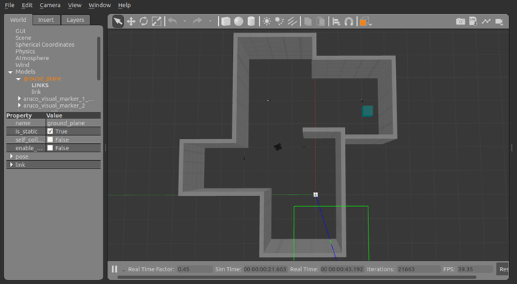
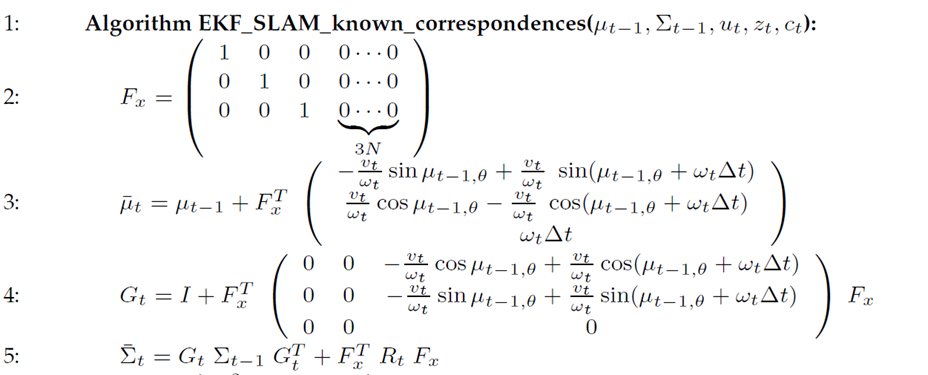
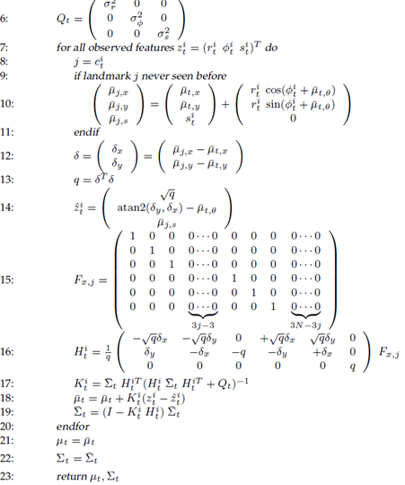

### SLAM Object Search


#### Description:

* This project aims to apply the Extended Kalman Filter for the Velocity Motion Model of a mobile robot to perform SLAM. 
* The reason the EKF was selected as the estimation algorithm was to understand some of the intricacies when in use, and to get a feel for some of its drawbacks.

#### Environment:

A Gazebo and ROS setup was used. The following environment with the Turtlebot3 and sparse Aruco landmarks was used:



#### Usage:

Run the following commands:

```
cd catkin_ws
catkin_make
source devel/setup.bash
```

Then run one of the two commands below:

```
roslaunch turtlebot3_gazebo ekf.launch
roslaunch turtlebot3_gazebo ekf_sensorMle.launch
```

#### Equations implemented in C++ (Eigen used matrix representations):

1. Prediction Step:


2. Correction Step:


#### Demo Videos:

* Red boundary = lidar scan taken from the actual turtlebot pose in gazebo world. Used as a reference to guage performance of EKF algorithm.
* Moving Axes = Actual and Estimated pose of turtlebot.
* Stationary Axes = Detected Aruco landmark markers.

##### Demo 1: Fixed Trajectory (provided by control.cpp):


##### Demo 2: Manual Control (using teleop node: ```rosrun turtlebot3_teleop turtlebot3_teleop_key```):


#### Results and Points to Note:

1. Both trials estimated the position of the robot and the landmarks with a +/-0.3m error margin.

2. States diverged primarily in places where there was no landmark to view and localize with.

3. Maximum Likelihood Estimate was used with a sample length of 30 sample before initializing the prior for each landmark. This helped reduce issues that occured by wrongly idenifying the landmark location in the first reading.  

4. To reduce numerical instability during matrix inversion (especially in the first few update steps), the covariance values of landmarks was changed from ```std::numeric_limits<double>::max()``` to ```1000```.

5. Use of velocity motion model requires robot to always move in arcs. Moving in a straight line for prolonged periods can lead to errors in robot heading. The heading of the robot will never be updated for linear motion and a small offset can accumulate over time. Thus motion is always in arcs (ie. angular_velocity is non zero always)

#### Future Work for Performance Improvement:

1. Process/Measurement noise matrices: The matrices R and Q which represent the covariance in the prediciton and correction step were set by trial and error. They should be set properly according to the wheel encoder and aruco marker detection specifications.

2. More Landmarks: States diverged primarily in places where there was no landmark to view and localize with. Including more landmarks so that the robot has at least a couple landmarks in sight at all times would help avoid this issue.

3. Other Filters/Smoothers: Test the same environment with other algorithms like Particle Filters or Smoothing and Mapping. This may resolve some of the issues faced in this paradigm.

